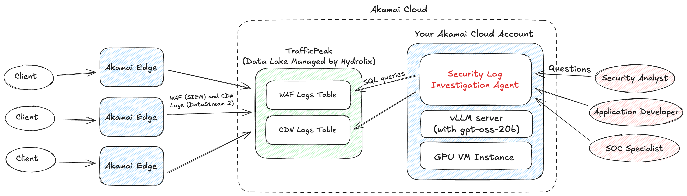
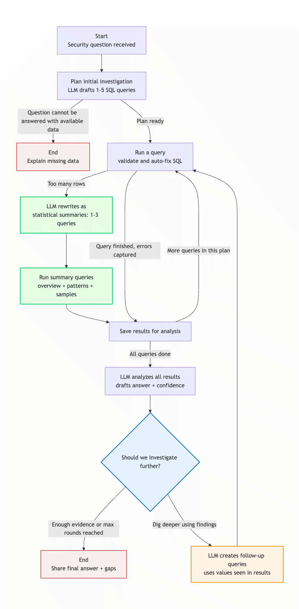

# Security Investigation Agent for Akamai SIEM/CDN Logs

A multi-round investigation agent for Akamai WAF (SIEM) and CDN (DataStream 2) logs, stored in TrafficPeak (a managed data platform with a ClickHouse-compatible interface), that turns natural-language security questions into iterative security investigations, delivering evidence-backed answers.

## About This Program

**Disclaimer**: This project is not an official Akamai product and is not supported or endorsed by Akamai Technologies. It is provided as-is without warranty of any kind.

This agent serves as an experimental proof-of-concept exploring whether context engineering techniques can enable small LLMs running on consumer-grade hardware (16GB VRAM) to perform complex security log analysis tasks.

It is not intended for production deployment at this stage. As an experimental system, it deliberately delegates workflow recovery to the LLM even in scenarios where deterministic code (such as SQL error correction) would be more reliable, prioritizing demonstration of LLM reasoning capabilities over production robustness.

## Architecture Diagram



## Key Technical Features

**Runs on Small LLMs (20B Parameters, 16GB VRAM)**
This agent achieves reliable SQL generation and investigation planning using `openai/gpt-oss-20b`, a 20-billion parameter model that requires only 16GB GPU memory. The key is an incremental planning architecture: the workflow breaks investigations into simple incremental rounds. Each round generates 1-5 straightforward SQL queries, synthesizes results, then decides if follow-up queries are needed. This iterative approach keeps individual LLM tasks simple enough for smaller models while enabling deep investigations through re-planning.

**Private Deployment for Sensitive Security Data**
All processing can be deployed to run within your own infrastructure via vLLM under your control. No security logs, attack data, or investigation results need to leave your network boundary, and WAF logs containing IP addresses, attack payloads, and blocked requests can remain on infrastructure you operate. This reduces the risk of sending sensitive data to third-party APIs.

**Domain-Specific Semantics Encoded in Prompts**
Akamai WAF logs appear simple, but without explicit security semantics, LLMs produce plausible-yet-wrong answers by treating them like ordinary web application databases. Two examples of systematic misinterpretation:

1. **Monitor mode as "attack success"**: Asked "how many attacks succeeded?", an LLM counts `appliedAction='monitor'` as successful attacks (not blocked = breach). Reality: monitor mode is a staged deployment strategy where new WAF rules observe traffic before blocking, validating false positive rates. The LLM conflates "risk management decision" with "attack outcome."

2. **Reputation blocks as false positives**: LLMs dismiss reputation-based blocking as false alarms because `ruleData` arrays are empty (no payload visible = no evidence). Reality: if IP `203.0.113.5` attacked at high frequency yesterday, Akamai may block it today regardless of current payload. Empty `ruleData` is expected for historical-behavior-based rules (`PENALTYBOX`, `REPUTATION`), not a quality issue.

Without explicit domain knowledge, even large LLMs fail at security log analysis, generating syntactically correct SQL that produces analytically wrong answers. This agent addresses this through structured prompts that encode domain rules: which fields mean what in security context, how detection mechanisms differ (payload-based vs. reputation-based), etc. No model fine-tuning is needed, but without rigorous prompt engineering, small LLMs cannot perform complex analysis, and even large LLMs produce confident nonsense. [Prompts are located in the `baml_src` directory](siem_agent/baml_src/)

**Iterative Investigation Instead of One-Shot Generation**
Traditional text-to-SQL systems fail on complex security questions because they must predict all necessary queries upfront. This agent uses an incremental planning architecture: it starts with simple baseline queries (e.g., "get top attacking IPs"), synthesizes results to identify anomalies, then generates targeted follow-up queries using discovered values (e.g., "analyze all requests from 203.0.113.5"). 

**Adaptive Query Rewriting Prevents Context Overflow**
Security investigations often generate massive result sets (tens of thousands of rows), but naive approaches either truncate data (losing critical patterns) or exceed LLM context windows. This agent detects result overflow automatically before retrieving all data, then delegates statistical rewriting to the LLM itself. The LLM transforms the original query into 1-3 targeted summary queries, preserving equivalent analytical insight while fitting comfortably in context.

**Structured Tags for Arithmetic and Fact Citation**
LLMs struggle with arithmetic (e.g., calculating percentage increases or rate comparisons) because they are token prediction models that learn numerical patterns from training data rather than executing symbolic computation rules. Additionally, LLMs may fabricate or misremember numbers from query results. This agent addresses both issues by externalizing all math and fact citation through inline pseudo-XML tags that the LLM embeds in its output:

- `<fact source="..." val="..." />`: cites a data source and numeric value from query results, preventing number hallucination
- `<calc formula="..." expr="..." precision="N" />`: declares a mathematical expression to be evaluated externally (e.g., `expr="211 / 712 * 100"`)

When synthesis requires computing "211 / 712 * 100", the LLM writes `<calc formula="..." expr="211 / 712 * 100" precision="1" />` and the post-processor evaluates it using a safe Python evaluator, returning "29.6" as a verified result. The LLM never performs mental math; it only decides which calculations are needed and declares them as structured tags. This makes both hallucinated numbers and calculation errors detectable and correctable.

**SQL Parsing Decouples Query Intent from Safety Guarantees**

LLMs are probabilistic. Even with careful prompting, a model might generate a `DELETE` statement when asked to "clean up the data," or be manipulated into accessing unauthorized tables by adversarial instructions embedded in th input or log data themselves. This agent addresses this by separating responsibilities: the LLM decides *what to query* (intent), while a deterministic SQL parser enforces *how* that query is allowed to execute (safety and correctness). Before any LLM-generated SQL reaches the database, it is parsed into an abstract syntax tree and subjected to two layers of deterministic enforcement:

- **Security boundary enforcement**: Any non-SELECT statement is rejected at the parsing layer, regardless of what the LLM generated, and only whitelisted tables are permitted. This prevents prompt injection embedded in log data from causing unintended writes or unauthorized access.

- **Systematic error correction**: Small LLMs often produce subtly wrong SQL, including wrong function names, mismatched column names, and invalid JOIN syntax. AST-level transforms automatically correct these known patterns: the LLM expresses analytical intent; the parser normalizes it into valid SQL.


**LLM-as-a-Judge for Regression Testing**
During development, this agent's analysis quality is validated through LLM-as-a-Judge evaluation for regression testing rather than traditional heuristics. When prompts or workflow logic change, automated tests execute the agent against pre-defined questions with known answers, then an LLM grader compares the agent's response to expected results.

**BAML for Reliable Structured I/O**
This agent uses [BAML (Basically a Made-up Language)](https://www.boundaryml.com/) instead of the native tool calling or structured output APIs that LLMs offer. Models' native function calling and constrained decoding appear reliable, but degrade significantly on smaller, self-hosted LLMs: models miss required fields, hallucinate JSON keys, or produce malformed output that silently breaks downstream logic. This instability makes the I/O boundary between the LLM and the agent workflow the most fragile point in the system, and it becomes worse as model size decreases. BAML takes a fundamentally different approach. Rather than constraining the model's token generation at decode time, BAML lets the model generate freely, then transforms imperfect LLM output into valid, typed data structures. This "be liberal in what you accept" philosophy means the agent gets well-typed outputs even when the underlying 20B-parameter model produces slightly malformed output. 

## Agent Workflow

1. **Plan**: LLM generates 1-5 simple SQL queries with answerability checks (requires explicit time period and target host in the question), validates against domain rules, and stores the investigation plan.
2. **Execute**: Runs queries sequentially with validation and one LLM-guided repair attempt on errors. Detects overflow and invokes statistical summary rewrite if the row limit is exceeded. Stores full results or summaries in execution history.
3. **Synthesize**: LLM analyzes all query results across all rounds, generates answer with <num> tags for numeric claims, assigns confidence level, and enumerates data gaps.
4. **Re-plan Decision**: LLM evaluates if additional investigation is needed by checking answer completeness, confidence, and remaining questions. Routes to re-planning if needed or ends the workflow.
5. **Re-plan**: Generates follow-up queries using specific values from previous results (e.g., discovered IP "203.0.113.5" → WHERE clientIP = '203.0.113.5'). Returns to execution step.



## Setup
- Copy `config.yaml.example` to `config.yaml` and fill in the ClickHouse connection details and credentials.
- Configure vLLM endpoints in `siem_agent/baml_src/clients.baml` and `test_runner/baml_src/clients.baml`: set `base_url` to your vLLM server address and `model` to the model name you are serving. After editing these files, run `uv run baml-cli generate` to regenerate the BAML client code.
- Ensure Python with `uv` (or your preferred runner) is available; dependencies are managed via `pyproject.toml`.

## Usage

### Command Line Interface (CLI)
`uv run -m siem_agent "How many SQL injection attacks occurred yesterday?"`

### Web Interface
The web frontend provides a browser-based interface for submitting investigations and viewing results asynchronously.

**Starting the Web Server:**
```bash
# Terminal 1: Start the web server (default: http://localhost:8080)
uv run -m web_ui

# Terminal 2: Start the worker process (executes jobs from the queue)
uv run -m web_ui.worker
```

**Features:**
- Submit investigation questions via web form
- Track job status with auto-refresh (pending → running → completed)
- View results with rendered `<num>` tags, collapsible query details, and statistics
- Job history and deletion
- No authentication (internal use only)

**Configuration:** Customize via environment variables (`SIEM_WEB_HOST`, `SIEM_WEB_PORT`, `SIEM_WEB_MAX_PENDING_JOBS`, etc.)

## Log Viewer

The Log Viewer is a standalone web application for inspecting the agent's session logs, designed for debugging investigations and understanding how the agent reasons through multi-round analysis.

When the agent produces unexpected results, understanding *why* requires tracing through every decision: which queries it planned, what data came back, how it synthesized results, and whether it chose to re-plan. The structured JSONL logs capture all of this, but reading raw JSON is impractical. The Log Viewer provides a browser-based interface that makes this investigation trace readable and navigable.

**Starting the Log Viewer:**
```bash
cd log-viewer && python app.py --logs-dir ../logs
# Opens at http://localhost:8081
```

## Example Interaction

This example demonstrates the agent's incremental planning and re-planning capabilities. The user asks a complex question about multi-phase attacks that requires correlating reconnaissance activity with subsequent exploitation attempts.

### User Question

> For www.example.com between 2026-01-01 and 2026-01-08, identify IP addresses that executed multi-phase attacks. Define phase 1 (reconnaissance) as requests to common discovery paths (`/.env%`, `/admin%`, `/wp-login%`, `/wp-admin%`, `/.git%`, `/config%`). Define phase 2 (exploitation) as WAF-detected events at least 1 hour after reconnaissance. Show the earliest reconnaissance timestamp, earliest exploitation timestamp, and ruleTags triggered during exploitation.

---

### Initial Investigation (Round 0)

**Planning**

The agent generates an investigation plan to identify multi-phase attackers:

```
Strategy: First, identify all IPs that made reconnaissance requests to the specified
discovery paths. Then, for those IPs, locate the earliest WAF-detected exploitation
event that occurred at least one hour after the first reconnaissance request. Finally,
list the unique ruleTags triggered during exploitation.
```

**Execution**

Query 1: *Find IPs that performed reconnaissance requests and their earliest timestamp*

```sql
SELECT cliIP, min(reqTimeSec) AS recon_ts
FROM akamai.logs
WHERE reqHost = 'www.example.com'
  AND reqTimeSec BETWEEN '2026-01-01T00:00:00Z' AND '2026-01-08T00:00:00Z'
  AND (reqPath LIKE '/.env%' OR reqPath LIKE '/admin%'
       OR reqPath LIKE '/wp-login%' OR reqPath LIKE '/wp-admin%'
       OR reqPath LIKE '/.git%' OR reqPath LIKE '/config%')
GROUP BY cliIP
```

Results (showing 5 of 28 IPs):
```
cliIP           | recon_ts
----------------+-------------------------
203.0.113.89    | 2026-01-01 00:46:39.276
203.0.113.15    | 2026-01-01 05:01:43.979
203.0.113.42    | 2026-01-01 21:48:28.563
203.0.113.127   | 2026-01-02 11:59:02.578
203.0.113.201   | 2026-01-03 15:50:40.625
... (23 more IPs)
```

**Synthesis**

The agent identifies 28 IP addresses that accessed common discovery paths but recognizes the investigation is incomplete:

> We have identified 28 IP addresses that accessed common discovery paths on www.example.com during the specified week. However, we have not yet determined which of these IPs later triggered WAF-detected exploitation events at least one hour after their reconnaissance activity. The next step is to correlate these IPs with WAF logs.

**Re-planning Decision**

```
Decision: Additional investigation needed

Rationale: The current results identify IPs that performed reconnaissance but do not
provide evidence of subsequent exploitation attempts. To answer the user's question,
we must join this reconnaissance data with WAF logs to find exploitation events that
occurred at least one hour later.
```

---

### Follow-up Investigation (Round 1)

**Re-planning**

The agent generates follow-up queries that use the reconnaissance results to identify multi-phase attackers:

```
Strategy: Join the reconnaissance set with the WAF SIEM logs to find exploitation
events that occurred at least one hour after the first reconnaissance request. For
each qualifying IP, retrieve the earliest exploitation timestamp and the ruleTags
triggered during that exploitation phase.
```

**Execution**

Query 2: *Find earliest exploitation timestamp and count per IP after reconnaissance*

```sql
SELECT siem.clientIP, min(siem.timestamp) AS exploit_ts, count() AS exploit_count
FROM akamai.siem AS siem
JOIN (
  SELECT cliIP, min(reqTimeSec) AS recon_ts
  FROM akamai.logs
  WHERE reqHost = 'www.example.com'
    AND reqTimeSec BETWEEN '2026-01-01T00:00:00Z' AND '2026-01-08T00:00:00Z'
    AND (reqPath LIKE '/.env%' OR reqPath LIKE '/admin%'
         OR reqPath LIKE '/wp-login%' OR reqPath LIKE '/wp-admin%'
         OR reqPath LIKE '/.git%' OR reqPath LIKE '/config%')
  GROUP BY cliIP
) AS recon ON siem.clientIP = recon.cliIP
WHERE siem.host = 'www.example.com'
  AND has(siem.attackTypes, 'WAF')
  AND siem.timestamp > recon.recon_ts + INTERVAL 1 HOUR
  AND siem.timestamp BETWEEN '2026-01-01T00:00:00Z' AND '2026-01-08T00:00:00Z'
GROUP BY siem.clientIP
```

Results:
```
clientIP      | exploit_ts           | exploit_count
--------------+----------------------+--------------
203.0.113.89  | 2026-01-01 22:45:30  | 13
203.0.113.15  | 2026-01-03 17:00:04  | 4
203.0.113.42  | 2026-01-04 09:39:31  | 4
```

Query 3: *List ruleTags triggered during exploitation events per IP*

```sql
SELECT siem.clientIP, siem.timestamp, ruleTag
FROM akamai.siem AS siem
ARRAY JOIN siem.ruleTags AS ruleTag
JOIN (
  SELECT cliIP, min(reqTimeSec) AS recon_ts
  FROM akamai.logs
  WHERE reqHost = 'www.example.com'
    AND reqTimeSec BETWEEN '2026-01-01T00:00:00Z' AND '2026-01-08T00:00:00Z'
    AND (reqPath LIKE '/.env%' OR reqPath LIKE '/admin%'
         OR reqPath LIKE '/wp-login%' OR reqPath LIKE '/wp-admin%'
         OR reqPath LIKE '/.git%' OR reqPath LIKE '/config%')
  GROUP BY cliIP
) AS recon ON siem.clientIP = recon.cliIP
WHERE siem.host = 'www.example.com'
  AND has(siem.attackTypes, 'WAF')
  AND siem.timestamp > recon.recon_ts + INTERVAL 1 HOUR
  AND siem.timestamp BETWEEN '2026-01-01T00:00:00Z' AND '2026-01-08T00:00:00Z'
ORDER BY siem.clientIP, siem.timestamp
```

Results (showing earliest exploitation events):
```
clientIP      | timestamp            | ruleTag
--------------+----------------------+---------------------------
203.0.113.89  | 2026-01-01 22:45:30  | ASE/WEB_ATTACK/LFI
203.0.113.89  | 2026-01-01 22:45:30  | ASE/WEB_ATTACK/LFI
203.0.113.15  | 2026-01-03 17:00:04  | ASE/WEB_ATTACK/LFI
203.0.113.15  | 2026-01-03 17:00:04  | ASE/WEB_ATTACK/LFI
203.0.113.42  | 2026-01-04 09:39:31  | AKAMAI/WAF/PENALTYBOX
203.0.113.42  | 2026-01-04 09:39:31  | ASE/WEB_ATTACK/LFI
... (34 more rows)
```

**Synthesis**

The agent now has complete data to answer all parts of the question:

> Across the week of 2026-01-01 to 2026-01-08, **28 unique client IPs** accessed common discovery paths on www.example.com. **Three of those IPs** later triggered WAF-detected exploitation events at least one hour after their first reconnaissance request:
>
> * **IP 203.0.113.89**: Reconnaissance at `2026-01-01 00:46:39`, exploitation at `2026-01-01 22:45:30` (22 hours later). Triggered ruleTags: `ASE/WEB_ATTACK/LFI`, `AKAMAI/WAF/PENALTYBOX`
>
> * **IP 203.0.113.15**: Reconnaissance at `2026-01-01 05:01:43`, exploitation at `2026-01-03 17:00:04` (60 hours later). Triggered ruleTag: `ASE/WEB_ATTACK/LFI`
>
> * **IP 203.0.113.42**: Reconnaissance at `2026-01-01 21:48:28`, exploitation at `2026-01-04 09:39:31` (60 hours later). Triggered ruleTags: `AKAMAI/WAF/PENALTYBOX`, `ASE/WEB_ATTACK/LFI`
>
> All three IPs used **Local File Inclusion (LFI)** attack techniques during the exploitation phase, and two were also flagged by Akamai's reputation-based penalty box system, indicating repeat offender status.

**Re-planning Decision**

```
Decision: Investigation complete

Rationale: The answer fully addresses all parts of the user's question: it identifies
IPs that performed both reconnaissance and exploitation phases, provides the earliest
timestamp for each phase, and lists the specific ruleTags triggered during exploitation.
No additional data is required.
```

## Disclaimer and Legal Notices

This is an independent, unofficial, third-party tool.

- This project is **not an official Akamai product**.
- It is not supported, endorsed, or affiliated with Akamai Technologies, Inc.
- "Akamai", "TrafficPeak", and related product names are trademarks of Akamai Technologies, Inc.
- This tool is developed as a personal project by an individual and is provided as-is without warranty of any kind.
- Use of Akamai trademarks in this documentation is for descriptive purposes only, to indicate compatibility with Akamai products.
